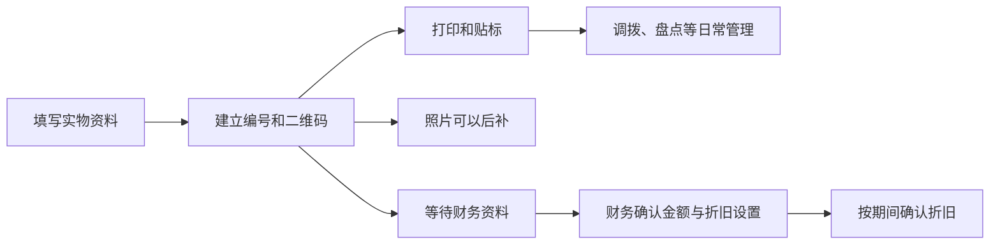

# 实物建档与财务折旧确认分离

日期：2026-09-09。来源：用户在当前项目任务中直接要求“建立新资产不需要财务复核”“发票来了财务才确认折旧”“建立资产不需要照片，可以建立后再拍”。这些明确要求优先于旧 AI 设计稿中的建档前置条件。

后续变化：2026-09-10 已实现并更新开发版的 [统一资产编码、组件和来源追溯](Asset-Coding-Standard.md)。首次管理属性与财务认定继续独立，初始化允许后补财务政策，IA 可确认电子台账；本页保存前一阶段的业务变化与验证记录。

## 用户确认的业务变化

- 实物建档与财务确认分开。原有建档权限的人员填写实物资料后即可建立正式编号和二维码，不需要先由财务复核。
- 财务在发票、金额等资料齐备后，另行确认会计认定和折旧设置；不会重新生成已有资产的编号或二维码，不改变实物使用状态。
- 资产照片为选填，可以建档、贴标或投入使用后再补拍。盘盈等其他业务的证据要求不因此取消。

## 当前操作方式

1. 新增资产的主要按钮为“建立资产”；资料未齐时仍可“暂存草稿”。实物分类、名称、单位、部门、责任人、位置及已有必填扩展字段继续按现有数据契约校验。
2. 正式建档后进入“待贴标”，标签的打印、逐项贴标与启用步骤保持原有逻辑。这些实物步骤不等待财务确认。
3. 资产详情提供“补拍照片”。手机可拍照或选择图片；普通附件继续受原文件校验与对象权限保护。
4. 财务从“待确认折旧”进入已建档资产，补充原值、会计认定、可用日期和折旧参数；发票作为财务附件按 A1 权限上传。系统不把未知金额自动写成 0，也不因未上传发票文件自动判定财务资料真实完整。
5. 未确认财务的资产不生成实际折旧记录，也不进入固定资产财务金额或 T+ 对账明细。实物台账仍包含该资产，T+ 导出提示未纳入的待确认资产，不因此阻断其他已确认资产的对账。

## 折旧日期的处理

用户未另行指定发票晚到时必须采用哪一种全局起算策略。本次沿用现有可配置机制：财务可以选择起算规则或指定日期，确认前不自动计提。发票到达日期不会自动替换折旧起算日期。

确认折旧参数与确认某期折旧分录仍是不同动作。若需要补计早期月份，由财务按选定日期通过正常折旧批次处理；已确认的历史分录不被静默重算或覆盖。财务表单的可选方法、期间、起算和残值方式明确显示“使用政策默认”，不会因为浏览器自动选中第一项而覆盖政策。选择固定残值金额时，只继承该模式适用的默认值，不再同时继承政策中的残值率；明确提交互相冲突的值仍会被拒绝。

## 权限与数据边界

- 原有建档角色和公司、部门范围继续执行。取消财务前置步骤，不等于向所有角色开放建档或财务写入。
- 有相应实物维护权限的用户可后补 A0 照片；A1 发票等财务附件仍由财务维护，并按财务可见范围提供下载。
- 财务确认失败时，回滚该次财务变更，保留之前已建立的实物档案、编号、二维码和使用状态。
- 未确认财务的资产可以参加实物管理及离职清退。需要锁定处置金额时仍须补齐财务确认，不能用虚构的零成本处置快照代替。

## 实现与兼容

- [实物建档服务](../apps/assets/registration.py) 负责建档、重试和编号/二维码的原子生成。
- [共享编码引擎](../apps/coding/issuance.py) 复用原有并发编号算法，编号永久登记和更正历史继续保留。
- `AssetRegistration` 是独立、不可变的实物建档结果；`AssetFinance.finance_confirmed_at` 表示财务确认，两个阶段各自保存记录。
- [财务待办查询](../apps/finance/readiness.py) 按财务确认状态筛选，不再依靠实物状态必须为 `pending_finance`。
- [迁移 0015](../apps/assets/migrations/0015_physical_registration.py) 为已有财务建档记录补充对应的实物建档记录，保留原资产、财务、编号和二维码标识。
- 旧 `pending_finance` 草稿保留，可直接办理实物建档。旧财务服务调用保留兼容路径；新页面的正常建档不依赖该路径。
- 已产生独立实物建档历史后，迁移会拒绝降回无法表示该状态的旧结构，避免丢失记录；旧流程中无照片的待办同样不能降回强制照片的旧约束。

## 验证与交付记录

当前测试清单为 **2052 个唯一用例**，已逐项对齐，无遗漏或未解决的功能失败：

- Windows/PostgreSQL 完整运行：2046 通过、4 个平台条件跳过、2 个 Windows `10055 / No buffer space available` 连接资源错误，原始日志保留。
- 上述两项单独复测：2 通过，43.03 秒。PostgreSQL 逐用例最新结果为 2048 通过、4 个平台条件跳过；不是一次未中断且无失败的全量运行。
- 4 个 SQLite 条件分支另行全部通过，43.28 秒；没有用 SQLite 替代 PostgreSQL 并发验证。
- 模型迁移检查：无遗漏变化；系统检查：无问题。
- 新增实物建档、财务分离、HTTP、报表、权限、事务回滚、并发及历史迁移用例；旧测试同步新业务要求。迁移测试结束后恢复完整最新 schema，避免污染后续测试；运行资源检查针对实际资源 URL，不对随机 CSRF 字符串作误判。

隔离浏览器实际完成无照片/无财务资料建档、后补照片、独立财务待办和后补财务确认，原编号保持不变。最终必填提示和“使用政策默认”选项已核对。390×844 视口下，补拍页与财务页均为 375/375 像素可用宽度/内容宽度，无横向溢出；控制台无错误或警告。真实手机摄像头与纸张标签没有在本轮实测。

证据位于 `var/asset-registration-20260909/`：`full-v2.xml`、`windows-resource-recheck.xml`、`sqlite-branches.xml`、`final-collection.txt`、`verification-summary.json`、`browser-verification.json`。早期失败记录没有覆盖或删除。

## 当前运行环境与升级记录

以下数量为 2026-09-10 上午升级时的历史记录。当日 12:47，用户另行授权 [清空开发业务数据](Development-Data-Reset-2026-09-10.md)，开发版已回到初始化状态，账号、备份和本次功能继续保留。

2026-09-10，用户对“先备份现有开发库和附件，再应用迁移并重启开发版；正式版不动”明确回复“允许”。此前的授权阻塞已解决，本次按该范围完成开发环境更新。

- 开发环境 `eam-lite-dev`、数据库 `eam_lite_dev` 已应用 `assets.0015_physical_registration`，刷新运行账号权限并重启服务；没有其他待执行迁移。访问地址为 <http://127.0.0.1:8766>。
- 升级前创建并验证数据库与附件的加密备份 `BKP-20260910084544-82A7C547`，额外保存至 `var/asset-registration-20260909/BKP-20260910084544-82A7C547.eambak`，复制后的 SHA256 与原包一致。备份仍使用现有备份密钥，密钥没有写入文档或日志。
- 升级前后 10 类原记录的数据指纹一致，包括 2 项资产、1 份财务记录、原编号及编号历史、4 条二维码身份记录、3 个附件及其关联。没有新增业务测试资产、改写历史财务或生成折旧分录。
- 迁移为原正式资产补充 1 条 `legacy_finance` 实物建档记录。运行账号可读取和插入建档记录，无删除和清空该表的权限。
- 更新后的服务系统检查通过；健康、版本和登录页面均返回 200。在数据库只读事务中，以现有用户权限检查了新建资产、财务待确认和后补照片页面，确认新功能已加载。

升级证据：`var/asset-registration-20260909/development-backup.json`、`development-before.json`、`development-after.json`、`development-postcheck.json`。**本次仅升级开发版，正式版未升级。**

本轮启动时，Docker Desktop 因 `sailor-ingest.sock` 和 `engine.sock` 旧通信文件不可访问而报错。检查确认相关目录只含零字节临时通信端点后，将旧目录改名保留并重建通信目录，Docker 引擎与原开发容器恢复运行。未删除数据卷、附件、镜像或设置。这是本机启动故障的恢复措施；[Docker 上游同类问题记录](https://github.com/docker/desktop-feedback/issues/460) 仅作为排障参考，不代表底层问题已永久修复。

曾尝试使用本机 Linux QA 镜像复核 Windows 资源错误，自动审批因新容器的源码和测试配置访问未获明确授权而拒绝；该方案没有执行。最终验证使用已获准的 Windows 隔离环境完成。

本次属于已有系统的业务流程调整，不是恢复旧 Sprint 的执行授权。开发和正式环境仍保持分离。
